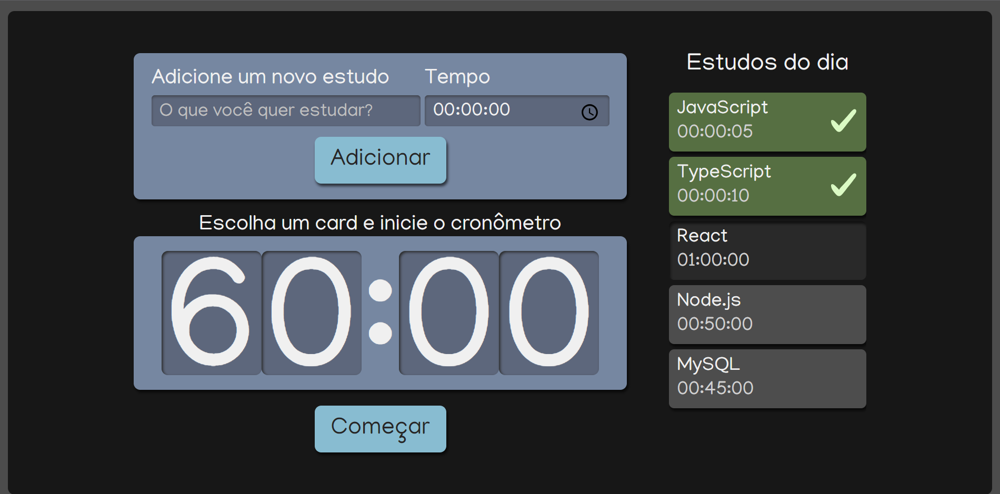

<<h1 align="center">Study Time</h1>

  

## Descrição e objetivo do projeto

Study Time é uma aplicação para criação de tarefas para estudos.

Similar ao método Pomodoro, a aplicação permite a criação de diversas tarefas e o gerenciamento do tempo de duração de cada uma.

As tarefas criadas ficam em uma lista, assim que uma delas é selecionada, o tempo dessa tarefa aparece no cronômetro da aplicação.

Após clicar no botão "Começar", um temporizador começa a reduzir o tempo da tarefa selecionada, quando esse tempo chegar a zero, a tarefa será completada e não poderá ser selecionada novamente.

Aplicação desenvolvida utilizando os principais conceitos e boas práticas do React.

## :heavy_check_mark: Tecnologias utilizadas

- `React`
- `TypeScript`
- `SCSS`

## :link: Acesso ao projeto

Você pode acessar o deploy do projeto na Vercel clicando [aqui](https://study-time-silk.vercel.app/).
